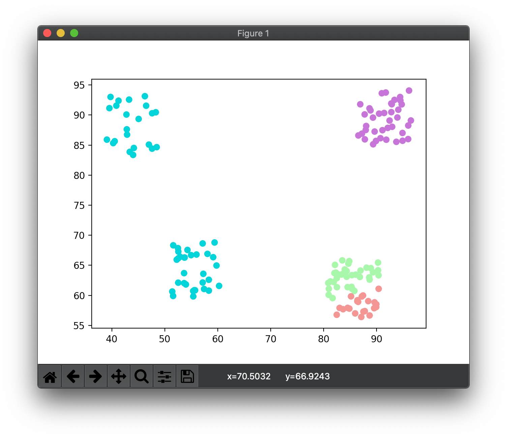

kmeans
======

An package for finding the optimal K for K means clustering for a given set of n-dimensional data points.

Implemented for Baylor College of Medicine Scientific Programmer I Assignment.

## Assignment Description

K means clustering is often used as an unsupervised data-analytics algorithm meant to find the ideal number of possible classes in a given dataset.

Your job is to implement a k-means clustering algorithm pipeline that takes in dataset file(s) such as the one found in the dataset folder and compute the best K for each dataset and output into another text file the file name followed by the estimated K for each one.

You are only allow to use numpy package, all other packages are prohibited.
Each line in the dataset file represent 1, n dimensional datapoint. We gave you one file to establish the format the test cases will be in.

Write the code to accomplish the task above as well make package it into a python package where we can install it and use it different codebase. (Should be pip3 installable)
You should share the code on GitHub so we can clone it on our side.

## Usage

### Install Package From GitHub

```bash
# create virtual environment
python3 -m venv ./env
source env/bin/activate

# install kmeans package
pip install git+https://github.com/davgra04/kmeans.git
```

### Use kmeans Package in Script

```python
# run_assignment.py
import kmeans

# process all datasets using default params
kmeans.process_all_datasets(max_clusters=10)

# OR specify parameters
#       max_clusters - maximum number of clusters to consider (iterates from 2 
#                      to max_clusters)
#                      default: num_data_points//5
#       kmeans_iter  - number of iterations to run kmeans for a given k
#                      (will use clustering with best silhouette score)
#                      default: 5
kmeans.process_all_datasets(max_clusters=10, kmeans_iter=5)
```

## Approach

### Performing k-means Clustering

I referred to the YouTube tutorial below to refresh on k-means clustering (it's been a while since University, haha). My algorithm pretty much follows the video, using Euclidean distance as the objective function to minimize for each cluster. It roughly operates as follows:

* Initialize centroids and grouping using random assignment (also included forgy method as an option)
* While we have not converged do:
  * Copy grouping numpy array for reference (previous_grouping)
  * Update grouping
    * Iterate through each data point, compare with each centroid, and assign the centroid with smallest distance to the data point
  * Update centroids
    * Iterate through centroids
      * If centroid's cluster contains no points, move to a randomly selected data point
      * Else, update according to minimized objective function
        * In the video, we take gradient of objective function, and set to 0 to find minimum. This yields mu_j = 1 / n_j * (sum of all points in current cluster)
  * Check if we have converged
    * If groupings have not changed for a set number of iterations (defined by threshold in the kmeans function), then we have converged so break out of loop.
* At this point we have converged, so return final centroids and grouping

### Determining Optimal k

I don't recall encountering this problem in University, so I referred to the Wikipedia article linked below (Determining the number of clusters in a data set). I wasn't sure which method would serve best in this situation, so I opted for "The silhouette method" in the interest of time. The goal is to determine the average silhouette of all points for each k, and select that value of k for which the average silhouette is closest to 1. It works roughly as follows:

* Iterate over k values
  * For each k, run k-means a number of times
    * If this k-means iteration's silhouette score is greater than what's been seen so far (for this k), save it.
  * If this k value's best silhouette score is greater than what's been seen overall (for all k's), save k as the best_k
* Once we're out of the loops, an "optimal" k has been selected and we return


## Problems

### Issues Clustering

My k-means implementation does not always select the best clustering. Sometimes it will split a cluster into 2, while assigning 2 groupings to a single cluster (illustrated below). 

I quickly attempted to compensate for this by running k-means multiple times and selecting the best silhouette score when solving for k.

For a proper fix, I would need to look into ways to improve the kmeans() function itself.

A good clustering:


A bad clustering on the same data set:



### It's Slow

Another problem is my implementation is rather slow. 

I attempted to compensate for this by allowing a max number of clusters to consider when iterating on k inside `solve_k()`. The number of iterations on executing k-means can also be lowered at the expense of accuracy.

The naive k-means algorithm seems relatively quick, but my `solve_k()` function might be able to lean on numpy more for speed gains.

## Primary Resources Used

* [YouTube tutorial on k-means clustering by 
mathematicalmonk](https://www.youtube.com/watch?v=0MQEt10e4NM)
* [(Wikipedia) k-means clustering](https://en.wikipedia.org/wiki/K-means_clustering)
* [(Wikipedia) Determining the number of clusters in a data set](https://en.wikipedia.org/wiki/Determining_the_number_of_clusters_in_a_data_set)
* [(Wikipedia) Silhouette (clustering)](https://en.wikipedia.org/wiki/Silhouette_(clustering))

